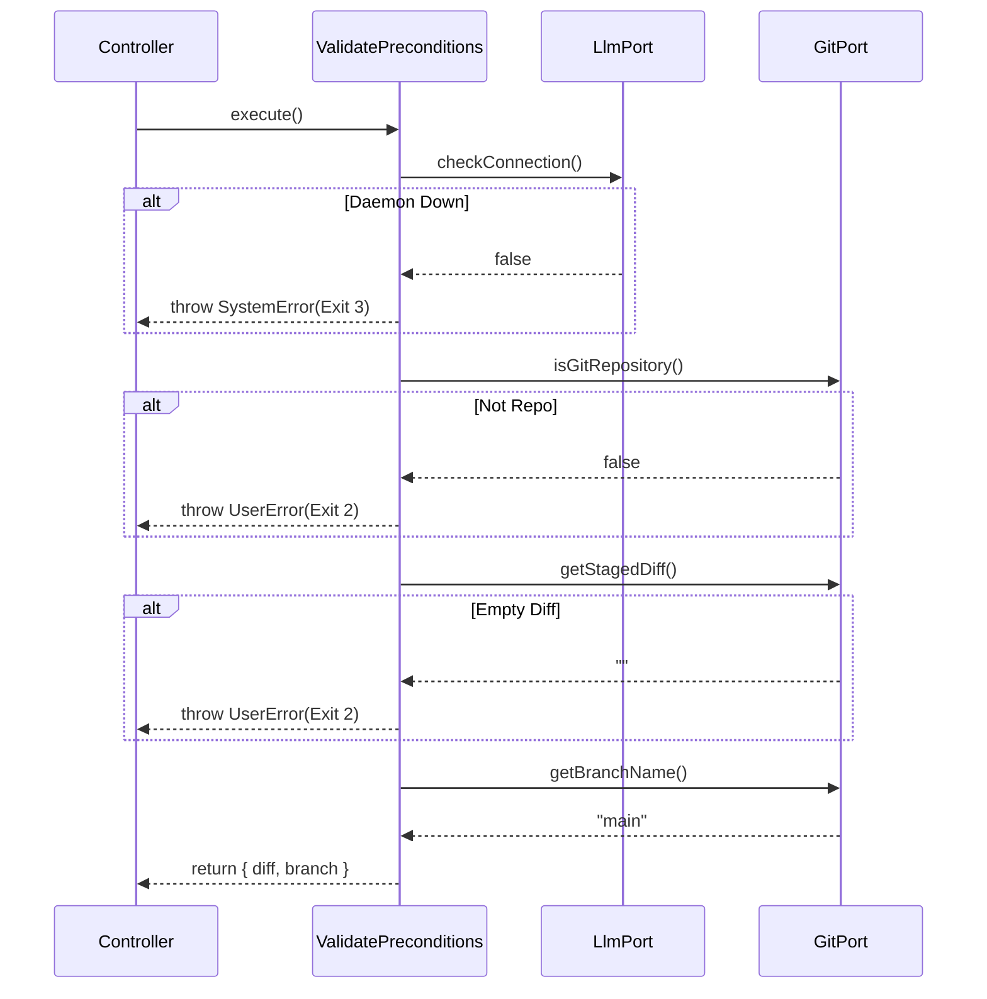

# Epic Technical Specification: Git & Editor Infrastructure

**Date:** 2025-11-30
**Epic ID:** 3
**Status:** Draft
**Dependencies:** Epic 1 (Foundation), Epic 2 (Ollama Integration)
**Author:** Architecture Agent

## Overview

Epic 3 establishes the Infrastructure Layer capabilities for interacting with the operating system—specifically Git repositories and the system text editor. It also implements the Application Layer logic for validating execution preconditions ("Fail Fast").

This epic enables the application to read the git state (diffs, branches), execute commits, and hand off control to the user's preferred editor (vim, nano, code) for manual message editing. It strictly follows the Hexagonal Architecture by defining Ports in the Core layer and implementing Adapters in the Infrastructure layer, ensuring the core logic remains testable and decoupled from the shell environment.

## Objectives and Scope

### In Scope:

- **Ports (Core):** Define GitPort and EditorPort interfaces with zero dependencies.
- **Adapters (Infrastructure):** Implement ShellGitAdapter (via execa) and ShellEditorAdapter (via spawn).
- **Use Case (Features):** Implement ValidatePreconditions to orchestrate the "Fail Fast" logic chain.
- **Error Handling:** Map low-level shell errors to domain UserError (e.g., "Not a repo") and SystemError (e.g., "Git binary missing").
- **Quality Gates:** Mandatory validation via npm run pr and regular linting.

### Out of Scope:

- Interactive prompts (Epic 5).
- AI Generation logic (Epic 4).
- The main CLI command wiring (Epic 5).

## Success Criteria

- ShellGitAdapter accurately reads staged diffs and executes commits in a real environment.
- ShellEditorAdapter launches a terminal editor, waits for input, and captures the result via temp file.
- ValidatePreconditions correctly identifies missing prerequisites and throws actionable UserErrors.
- Code Quality: 100% unit test coverage for Use Cases; Adapters tested via mocks.

## System Architecture Alignment

### Hexagonal Architecture Implementation:

- **Core Layer (Ports):** `src/core/ports/git-port.ts` and `src/core/ports/editor-port.ts`. These define what the application needs.
- **Infrastructure Layer (Adapters):** `src/infrastructure/adapters/shell-git-adapter.ts` and `src/infrastructure/adapters/shell-editor-adapter.ts`. These define how it is achieved using Node.js APIs (execa, spawn, fs).
- **Feature Layer (Use Case):** `src/features/commit/use-cases/validate-preconditions.ts`. This contains the business rule "We cannot generate a commit if there are no staged changes."

### Key Architectural Patterns:

- **Adapter Pattern:** Isolates execa dependencies to a single file.
- **Temp File Pattern:** Uses `.git/COMMIT_EDITMSG_OLLATOOL` to interface with editors safely, ensuring cleanup in finally blocks.
- **Fail Fast:** Preconditions are validated explicitly before any expensive operations (like AI generation) begin.

## Detailed Design

### Services and Modules

| Module                | Responsibility                     | Inputs       | Outputs        | Owner/Location                                            |
| --------------------- | ---------------------------------- | ------------ | -------------- | --------------------------------------------------------- |
| GitPort               | Interface for Git operations.      | N/A          | Interface      | `src/core/ports/git-port.ts`                              |
| EditorPort            | Interface for System Editor.       | N/A          | Interface      | `src/core/ports/editor-port.ts`                           |
| ShellGitAdapter       | Implements GitPort using execa.    | Git commands | Strings/Void   | `src/infrastructure/adapters/shell-git-adapter.ts`        |
| ShellEditorAdapter    | Implements EditorPort using spawn. | Initial text | Edited text    | `src/infrastructure/adapters/shell-editor-adapter.ts`     |
| ValidatePreconditions | Orchestrates checks.               | Ports        | Context Object | `src/features/commit/use-cases/validate-preconditions.ts` |

### Data Models & Contracts

#### GitPort Interface:

```typescript
import { UserError, SystemError } from '../../core/types/errors.types';

export interface GitPort {
  isGitRepository(): Promise<boolean>;
  getStagedDiff(): Promise<string>; // Returns empty string if no changes
  getBranchName(): Promise<string>;
  commitChanges(message: string): Promise<void>;
}
```

#### EditorPort Interface:

```typescript
import { UserError, SystemError } from '../../core/types/errors.types';

export interface EditorPort {
  /**
   * Opens the system editor with the given initial content.
   * @param initialContent The text to pre-fill in the editor.
   * @returns The text content after the user saves and quits.
   */
  openEditor(initialContent: string): Promise<string>;
}
```

#### Precondition Context (Return Value):

```typescript
import { UserError, SystemError } from '../../core/types/errors.types';

export interface CommitContext {
  diff: string;
  branch: string;
  // status: string; // (Future expansion for file list)
}
```

## Workflows and Sequencing

### Precondition Validation Flow:



## Quality Assurance & Testing

### Implementation & Validation Guidelines

**🚨 CRITICAL: READ BEFORE CODING**

### 1. Context7 MCP Integration (Enterprise Validation)

Before implementing any new library or framework logic, you **MUST** validate patterns using the Context7 MCP server.

- **Resolve Library:** `mcp__context7__resolve-library-id(library_name)`
- **Get Best Practices:** `mcp__context7__get-library-docs(library_id)`
- _Applicable Libraries for this Epic:_ `execa`, `vitest`, `@clack/prompts`, `commander` (as relevant).

### 2. Mandatory Style Guides

All code must strictly adhere to the project's established standards. **Review these before writing a single line of code.**

- **Coding Standards:** `dev/styleguides/clean-code.md` (Focus: Function size <15 lines, meaningful variable names).
- **Testing Standards:** `dev/styleguides/unit-test-patterns.md` (Focus: Co-located tests, Vitest mocking patterns).

### 3. Iterative Development Workflow (The Loop)

Do not write all code at once. Follow this cycle for **every single story**:

1.  **Red:** Write the unit test first (it should fail).
2.  **Green:** Write the minimal code to pass the test.
3.  **Refactor:** Clean up the code while keeping tests green.
4.  **Sanitize:** Run `npm run format` and `npm run lint` immediately. **Fix lint errors now, not later.**
5.  **Commit:** Commit the working state before moving to the next AC.

### 4. Dynamic Test Adjustment

- If implementation details change during development, **update the tests immediately**.
- Never comment out a failing test to "fix it later."
- If a test is brittle (e.g., visual CLI output), refactor the logic to return data instead of side effects, then test the data.

### 5. Final Quality Gate

Before marking any Story or Epic as **Complete**, you must run the full validation suite.

- **Command:** `npm run pr`
- **Requirement:** All checks (Lint, Format, Types, Tests, Build) must pass with **zero warnings**.
- **Output:** Paste the success output in the completion report.

### Mandatory Testing Protocol:

- **Format & Lint:** Run `npm run format && npm run lint` between every file creation.
- **Unit Tests:** Create `*.test.ts` files co-located with implementation.
- **Final Gate:** `npm run pr` must pass before marking epic complete.

### Unit Testing Approach

#### Test Boundary: ShellGitAdapter

- **Mock:** `execa` (using `vi.mock('execa')`).
- **Scenarios:**
  - `getStagedDiff`: Mock stdout with diff content.
  - `getStagedDiff`: Mock stdout as empty string.
  - `commitChanges`: Mock success and failure (non-zero exit code).

#### Test Boundary: ShellEditorAdapter

- **Mock:** `fs/promises` and `child_process.spawn`.
- **Scenarios:**
  - Happy Path: Temp file written → spawn called → file read → cleanup.
  - Error Path: Spawn fails → cleanup still happens.
  - Verify `$EDITOR` env var is used if present.

#### Test Boundary: ValidatePreconditions

- **Mock:** GitPort and LlmPort implementations.
- **Scenarios:**
  - Fail at Daemon check.
  - Fail at Git Repo check.
  - Fail at Staged Changes check.
  - Success returns correct context object.

### Traceability Mapping

| AC#      | Story | Component             | Requirement      | Test Idea                         |
| -------- | ----- | --------------------- | ---------------- | --------------------------------- |
| AC-3.1.1 | 3.1   | GitPort               | Define Interface | Compile check                     |
| AC-3.1.2 | 3.1   | ShellGitAdapter       | Implement execa  | Mock execa output                 |
| AC-3.1.3 | 3.1   | ShellGitAdapter       | Error Mapping    | Throw system error on git missing |
| AC-3.2.1 | 3.2   | EditorPort            | Define Interface | Compile check                     |
| AC-3.2.2 | 3.2   | ShellEditorAdapter    | Temp File Logic  | Mock fs.writeFile/unlink          |
| AC-3.2.3 | 3.2   | ShellEditorAdapter    | stdio: inherit   | Inspect spawn args                |
| AC-3.3.1 | 3.3   | ValidatePreconditions | Fail Fast Logic  | Mock failure chains               |
| AC-3.3.2 | 3.3   | ValidatePreconditions | Context Return   | Assert object structure           |

## Risks and Assumptions

### RISK-3.1: Editor Compatibility

- **Description:** spawn behavior varies across shells (zsh/bash/fish) and editors (vim/code/nano).
- **Mitigation:** Use `stdio: 'inherit'` which reliably passes TTY control. Test manually with nano and vim.

### RISK-3.2: Git Version Differences

- **Description:** Output of git status or git diff might vary slightly by version.
- **Mitigation:** Use plumbing commands (--porcelain, --cached) which are stable.

### Assumption:

User has git installed and in PATH. If not, ShellGitAdapter throws SystemError.

## Implementation Decisions

### DECISION-3.1: Use execa for Git

- **Rationale:** Better promise handling, cross-platform support, and cleaner syntax than native child_process.

### DECISION-3.2: Synchronous Validation Chain

- **Rationale:** Checks are sequential dependencies (cannot check staged files if not a repo). `await` chain is simpler and safer than `Promise.all`.
