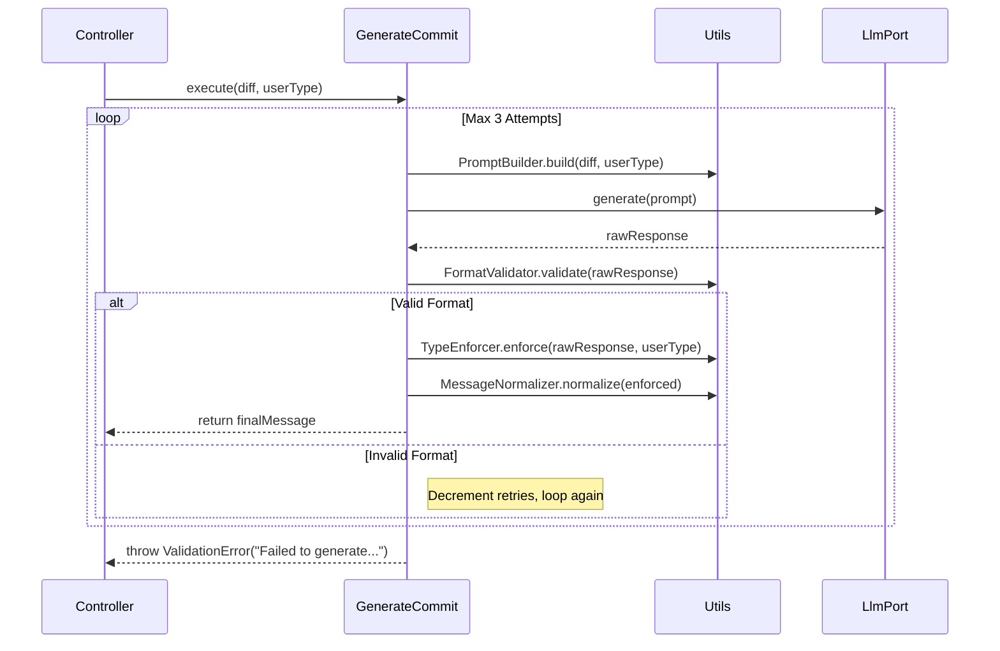

# Epic Technical Specification: AI Generation Logic

**Date:** 2025-11-30
**Epic ID:** 4
**Status:** Draft
**Dependencies:** Epic 2 (Ollama Integration), Epic 3 (Git Context)
**Author:** Architecture Agent

## Overview

Epic 4 implements the Core Domain Logic for the application: transforming a raw Git diff into a high-quality, compliant Conventional Commit message. It acts as the "Brain" of the CLI tool.

This epic strictly adheres to the Pragmatic Hexagonal Architecture by isolating business rules into pure functions (Domain Utilities) and orchestration logic into Use Cases. It addresses the inherent non-determinism of LLMs (hallucinations, chatty output, bad formatting) through a deterministic pipeline of validation, silent retries, and strict type enforcement.

The primary goal is to deliver a GenerateCommit use case that is robust enough to handle "bad" AI responses automatically, ensuring the user only ever sees a valid, formatted commit message or a clear failure reason.

## Objectives and Scope

### In Scope:

**Domain Utilities (Pure Functions):** Implementation of stateless logic helpers:

- **PromptBuilder:** Constructs optimized prompts from diffs and user inputs.
- **FormatValidator:** Enforces regex-based structural integrity.
- **TypeEnforcer:** Overwrites AI-generated types with user-selected types (Hallucination prevention).
- **MessageNormalizer:** Applies stylistic rules (trimming, capitalization).

**Application Logic (Use Case):** Implementation of GenerateCommit to orchestrate the generation loop.

**Reliability:** Implementation of the "Silent Retry" mechanism (Max 3 attempts) to handle invalid LLM outputs without user friction.

**Error Handling:** Propagation of SystemError (LLM failure) and ValidationError (Exhausted retries).

### Out of Scope:

- UI/Visualization: Spinners and progress bars (handled in Epic 5).
- Direct Ollama API Calls: Handled via LlmPort (Epic 2).
- Git Operations: Handled via GitPort (Epic 3).
- Configuration Parsing: Handled via hardcoded defaults (MVP) or Config Loader (Post-MVP).

## Success Criteria

- GenerateCommit.execute() returns a valid Conventional Commit string or throws a typed error.
- The system automatically recovers from at least 2 consecutive "invalid" AI responses (e.g., chatty output) during a single execution.
- Commit types selected by the user are strictly enforced (e.g., user selects feat, AI outputs fix, result is feat).
- Code Quality: 100% unit test coverage for Domain Utils; 100% logic coverage for Use Case.

## System Architecture Alignment

### Hexagonal Architecture Implementation:

- **Core Domain (Utils):** `src/features/commit/utils/`. These are Pure Functions with NO dependencies (no imports from infrastructure or ollama). They represent the immutable business rules of the application.
- **Application Layer (Use Case):** `src/features/commit/use-cases/generate-commit.ts`. This orchestrates the flow. It depends only on the LlmPort interface (defined in `src/core/ports/llm-port.ts`).

### Key Architectural Patterns:

- **Strategy Pattern:** The generation logic is treated as a specific strategy for obtaining a commit message.
- **Pure Functional Core:** All text processing (building prompts, validating regex, replacing strings) is separated from I/O. This makes the most complex logic the easiest to test.
- **Silent Retry:** The retry loop is encapsulated entirely within the Use Case. The Controller (Epic 5) is unaware of how many attempts were made.

## Detailed Design

### Services and Modules

| Module            | Responsibility                    | Inputs            | Outputs         | Owner/Location                                     |
| ----------------- | --------------------------------- | ----------------- | --------------- | -------------------------------------------------- |
| PromptBuilder     | Constructs the prompt string.     | diff, type        | string          | `src/features/commit/utils/prompt-builder.ts`      |
| FormatValidator   | Validates message structure.      | message           | boolean         | `src/features/commit/utils/format-validator.ts`    |
| TypeEnforcer      | Enforces user intent on type.     | message, userType | string          | `src/features/commit/utils/type-enforcer.ts`       |
| MessageNormalizer | Cleans/formats the message.       | message           | string          | `src/features/commit/utils/message-normalizer.ts`  |
| GenerateCommit    | Orchestrates the generation loop. | diff, type        | Promise<string> | `src/features/commit/use-cases/generate-commit.ts` |

### Data Models & Contracts

#### Prompt Template (Internal to PromptBuilder):

**Note:** The complete System Prompt is defined in `tech-spec-epic-2.md` (lines 165-175) and includes the full Conventional Commits specification, critical rules, and few-shot examples. The PromptBuilder utility constructs only the user-facing portion that gets combined with this System Prompt at runtime.

**User Prompt Template:**

```
User selected type: {type}

Git Diff:
{diff}

Instructions:

1. Output ONLY the commit message - no conversational text, no markdown, no code blocks
2. Format: <type>: <description>
3. Use the user-selected type: {type}
4. Description: imperative mood, lowercase, no period, <50 characters
```

**System Prompt Reference:** The complete Conventional Commits system prompt is configured in `src/infrastructure/config/conventional-commit-model.config.ts` and includes:

- Full type definitions (feat, fix, docs, style, refactor, perf, test, build, ci, chore, revert)
- Detailed formatting rules and constraints
- Few-shot examples for quality assurance
- Critical rules to prevent conversational output

This separation ensures the PromptBuilder focuses on runtime context (diff + user type) while the System Prompt maintains consistent formatting rules across all generations.

#### Regex Contract (Internal to FormatValidator):

- **Pattern:** `/^\w+(\(.+\))?: .+$/`
- **Constraint:** Must start with a word (type), optional scope in parens, a colon, a space, and then text.

## Workflows and Sequencing

### Generation Loop (The "Brain"):



## Quality Assurance & Testing

### Implementation & Validation Guidelines

**🚨 CRITICAL: READ BEFORE CODING**

### 1. Context7 MCP Integration (Enterprise Validation)

Before implementing any new library or framework logic, you **MUST** validate patterns using the Context7 MCP server.

- **Resolve Library:** `mcp__context7__resolve-library-id(library_name)`
- **Get Best Practices:** `mcp__context7__get-library-docs(library_id)`
- _Applicable Libraries for this Epic:_ `execa`, `vitest`, `@clack/prompts`, `commander` (as relevant).

### 2. Mandatory Style Guides

All code must strictly adhere to the project's established standards. **Review these before writing a single line of code.**

- **Coding Standards:** `dev/styleguides/clean-code.md` (Focus: Function size <15 lines, meaningful variable names).
- **Testing Standards:** `dev/styleguides/unit-test-patterns.md` (Focus: Co-located tests, Vitest mocking patterns).

### 3. Iterative Development Workflow (The Loop)

Do not write all code at once. Follow this cycle for **every single story**:

1.  **Red:** Write the unit test first (it should fail).
2.  **Green:** Write the minimal code to pass the test.
3.  **Refactor:** Clean up the code while keeping tests green.
4.  **Sanitize:** Run `npm run format` and `npm run lint` immediately. **Fix lint errors now, not later.**
5.  **Commit:** Commit the working state before moving to the next AC.

### 4. Dynamic Test Adjustment

- If implementation details change during development, **update the tests immediately**.
- Never comment out a failing test to "fix it later."
- If a test is brittle (e.g., visual CLI output), refactor the logic to return data instead of side effects, then test the data.

### 5. Final Quality Gate

Before marking any Story or Epic as **Complete**, you must run the full validation suite.

- **Command:** `npm run pr`
- **Requirement:** All checks (Lint, Format, Types, Tests, Build) must pass with **zero warnings**.
- **Output:** Paste the success output in the completion report.

### Mandatory Testing Protocol:

- **Format & Lint:** Run `npm run format && npm run lint` between every file creation.
- **Unit Tests:** Create `*.test.ts` files co-located with implementation.
- **Final Gate:** `npm run pr` must pass before marking epic complete.

### Mandatory Testing Protocol:

- **Format & Lint:** Run `npm run format && npm run lint` between every file creation.
- **Unit Tests:** Create `*.test.ts` files co-located with implementation.
- **Final Gate:** `npm run pr` must pass before marking epic complete.

### Unit Testing Approach

#### Test Boundary: Domain Utilities (Pure Functions)

These require NO mocks.

**PromptBuilder:** Verify diff injection and type insertion.

**FormatValidator:**

- `validate("feat: add login")` -> `true`
- `validate("Here is the commit: feat: add login")` -> `false` (Chatty)
- `validate("feat add login")` -> `false` (Missing colon)

**TypeEnforcer:**

- `enforce("fix: update api", "feat")` -> `"feat: update api"`
- `enforce("fix(auth): update api", "feat")` -> `"feat(auth): update api"` (Preserve Scope)

**MessageNormalizer:**

- `normalize(" feat: add stuff. ")` -> `"feat: Add stuff"` (Trim, Cap, No dot)

#### Test Boundary: GenerateCommit (Use Case)

Requires mocking LlmPort.

**Scenario: Happy Path**

- Mock LlmPort.generate returns valid string on 1st try.
- Assert result is normalized.

**Scenario: Silent Retry Success**

- Mock LlmPort.generate returns "Chatty garbage" (1st), then "feat: valid" (2nd).
- Assert LlmPort.generate called 2x.
- Assert result matches 2nd response (normalized).

**Scenario: Exhausted Retries**

- Mock LlmPort.generate returns "Garbage" 3x.
- Assert ValidationError is thrown.

### Traceability Mapping

| AC#      | Story | Component         | Requirement        | Test Idea                      |
| -------- | ----- | ----------------- | ------------------ | ------------------------------ |
| AC-4.1.1 | 4.1   | PromptBuilder     | Template Structure | Regex match on output          |
| AC-4.1.2 | 4.1   | FormatValidator   | Validation Logic   | Array of valid/invalid strings |
| AC-4.1.3 | 4.1   | TypeEnforcer      | Type Swapping      | fix -> feat scenarios          |
| AC-4.1.4 | 4.1   | MessageNormalizer | Formatting Rules   | input vs expected pairs        |
| AC-4.2.1 | 4.2   | GenerateCommit    | Orchestration      | Spy on Utils calls             |
| AC-4.2.2 | 4.2   | GenerateCommit    | Retry Mechanism    | Mock sequential returns        |
| AC-4.2.3 | 4.2   | GenerateCommit    | Error Propagation  | Mock SystemError from Port     |

## Risks and Assumptions

### RISK-4.1: Model Hallucinations (Medium)

- **Description:** Small models (1.5B) often ignore system prompts and output conversational text.
- **Mitigation:** The FormatValidator + Retry Loop is specifically designed to catch this. The TypeEnforcer handles the case where the model generates a valid commit but ignores the requested type.

### RISK-4.2: Infinite Retry Loops (Low)

- **Description:** Logic error in loop condition could hang the CLI.
- **Mitigation:** Strict counter decrement (retries--) in the while loop condition.

### Assumption:

The diff passed to the prompt builder fits within the model's context window. (Truncation logic is deferred to Post-MVP).

## Implementation Decisions

### DECISION-4.1: Regex Validation vs. Schema

- **Decision:** Use simple Regex (`/^\w+: .+$/) instead of a heavy schema library (Zod) for message validation.
- **Rationale:** We are validating a single string format, not a complex JSON object. Regex is faster and sufficient for MVP.

### DECISION-4.2: Enforce "User Selection is Truth"

- **Decision:** If the user asks for a feat and the AI gives a fix, we rewrite it to feat programmatically.
- **Rationale:** We trust the user's intent more than the AI's classification. Asking the AI to regenerate just to change the word "fix" to "feat" is a waste of time/tokens.
