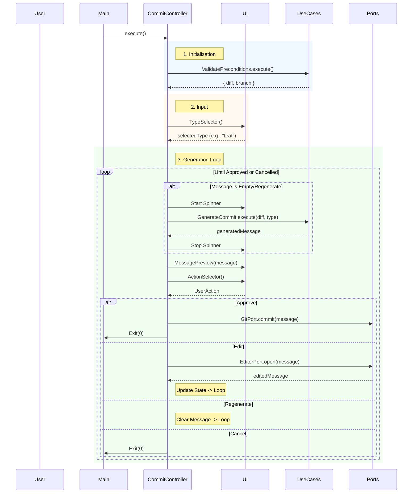

# Epic Technical Specification: Interactive Workflow & CLI

**Date:** 2025-11-30
**Epic ID:** 5
**Status:** Draft
**Dependencies:** Epic 3 (Git/Editor), Epic 4 (Generation)
**Author:** Architecture Agent

## Overview

Epic 5 represents the Interface Layer of the application. It establishes the "Composition Root" where all dependencies are wired together and implements the interactive Terminal User Interface (TUI) that users interact with daily.

This epic implements the CommitController, which acts as the central state machine for the user's session. It orchestrates the flow between validating preconditions (Epic 3), gathering user intent, generating content via AI (Epic 4), and executing the final commit. It leverages @clack/prompts to provide a modern, accessible, and visually consistent experience that feels like a native part of the developer's workflow.

## Objectives and Scope

### In Scope:

**UI Components (Interface Layer):** Implementation of stateless, reusable UI wrappers for @clack/prompts:

- **TypeSelector:** Interactive list for selecting Conventional Commit types.
- **MessagePreview:** Visualizer for the generated commit message.
- **ActionSelector:** Menu for the Approve/Edit/Regenerate/Cancel loop.

**Application Controller (Orchestrator):** Implementation of CommitController to manage application state (diff, type, message) and transitions.

**Composition Root:** Wiring of all Adapters, Use Cases, and Controllers in `src/main.ts`.

**CLI Entry Point:** Registration of the ollatool commit command in Commander.js.

**Quality Gates:** Mandatory validation via npm run pr.

### Out of Scope:

- Business Logic: Pure generation/validation logic (handled in Epic 4).
- System IO: Raw Git or Editor execution (handled in Epic 3).
- Setup Logic: Model provisioning (handled in Epic 2).

## Success Criteria

- Users can complete the full "Happy Path" (Type -> Generate -> Preview -> Approve) in <5 seconds (excluding AI latency).
- The "Edit" workflow correctly launches the system editor, captures changes, and updates the preview state.
- The UI handles loading states (spinners) gracefully without visual glitching.
- Code Quality: 100% unit test coverage for Controller logic; Manual verification for UI components.

## System Architecture Alignment

### Hexagonal Architecture Implementation:

- **Interface Layer (UI):** `src/ui/components/`. These modules are Stateless. They accept data (e.g., a list of types) and return user input (e.g., selected type). They contain no business logic.
- **Application Layer (Controller):** `src/features/commit/controllers/commit-controller.ts`. This is the "Traffic Cop." It coordinates the GitPort, EditorPort, and GenerateCommit use case. It holds the session state.
- **Composition Root:** `src/main.ts`. This is the only place where new Class() is called for dependencies.

### Key Architectural Patterns:

- **State Machine:** The Controller explicitly manages the transition between states (Input -> Generating -> Review -> Editing -> Committing).
- **Dependency Injection:** The Controller receives all its dependencies (Ports and Use Cases) via its constructor, enabling trivial unit testing of the orchestration logic.
- **Observer/Interactive:** The application pauses execution to wait for user input (`await typeSelector()`) before proceeding.

## Detailed Design

### Services and Modules

| Module           | Responsibility                       | Inputs       | Outputs           | Owner/Location                                         |
| ---------------- | ------------------------------------ | ------------ | ----------------- | ------------------------------------------------------ |
| TypeSelector     | UI prompt for selecting commit type. | `types[]`    | `Promise<string>` | `src/ui/components/type-selector.ts`                   |
| MessagePreview   | Visualizes the commit message.       | `message`    | `void`            | `src/ui/components/message-preview.ts`                 |
| ActionSelector   | UI prompt for next action.           | N/A          | `Promise<Action>` | `src/ui/components/action-selector.ts`                 |
| CommitController | Main State Machine & Orchestrator.   | Dependencies | `Promise<void>`   | `src/features/commit/controllers/commit-controller.ts` |
| Main             | Wiring & Command Registration.       | `argv`       | Exit Code         | `src/main.ts`                                          |

### Data Models & Contracts

#### UI Component Contracts:

```typescript
// Action Enum for type safety
export enum CommitAction {
  APPROVE = 'approve',
  EDIT = 'edit',
  REGENERATE = 'regenerate',
  CANCEL = 'cancel',
}

// Function Signatures
export type TypeSelectorFn = () => Promise<string>;
export type ActionSelectorFn = () => Promise<CommitAction>;
export type MessagePreviewFn = (message: string) => void;
```

#### Controller State (Internal):

```typescript
interface ControllerState {
  diff: string; // From GitPort
  branch: string; // From GitPort
  commitType: string; // From TypeSelector
  message: string; // From GenerateCommit or EditorPort
}
```

## Workflows and Sequencing

### Main Controller Loop:



## Quality Assurance & Testing

### Implementation & Validation Guidelines

**🚨 CRITICAL: READ BEFORE CODING**

### 1. Context7 MCP Integration (Enterprise Validation)

Before implementing any new library or framework logic, you **MUST** validate patterns using the Context7 MCP server.

- **Resolve Library:** `mcp__context7__resolve-library-id(library_name)`
- **Get Best Practices:** `mcp__context7__get-library-docs(library_id)`
- _Applicable Libraries for this Epic:_ `execa`, `vitest`, `@clack/prompts`, `commander` (as relevant).

### 2. Mandatory Style Guides

All code must strictly adhere to the project's established standards. **Review these before writing a single line of code.**

- **Coding Standards:** `dev/styleguides/clean-code.md` (Focus: Function size <15 lines, meaningful variable names).
- **Testing Standards:** `dev/styleguides/unit-test-patterns.md` (Focus: Co-located tests, Vitest mocking patterns).

### 3. Iterative Development Workflow (The Loop)

Do not write all code at once. Follow this cycle for **every single story**:

1.  **Red:** Write the unit test first (it should fail).
2.  **Green:** Write the minimal code to pass the test.
3.  **Refactor:** Clean up the code while keeping tests green.
4.  **Sanitize:** Run `npm run format` and `npm run lint` immediately. **Fix lint errors now, not later.**
5.  **Commit:** Commit the working state before moving to the next AC.

### 4. Dynamic Test Adjustment

- If implementation details change during development, **update the tests immediately**.
- Never comment out a failing test to "fix it later."
- If a test is brittle (e.g., visual CLI output), refactor the logic to return data instead of side effects, then test the data.

### 5. Final Quality Gate

Before marking any Story or Epic as **Complete**, you must run the full validation suite.

- **Command:** `npm run pr`
- **Requirement:** All checks (Lint, Format, Types, Tests, Build) must pass with **zero warnings**.
- **Output:** Paste the success output in the completion report.

### Mandatory Testing Protocol:

- **Format & Lint:** Run `npm run format && npm run lint` between every file creation.
- **Unit Tests:** Create `*.test.ts` files co-located with implementation.
- **Final Gate:** `npm run pr` must pass before marking epic complete.

### Mandatory Testing Protocol:

- **Format & Lint:** Run `npm run format && npm run lint` between every file creation.
- **Unit Tests:** Co-located `.test.ts` files.
- **Final Gate:** `npm run pr` must pass.

### Unit Testing Approach

#### Test Boundary: UI Components (Stateless)

**Note:** Visual testing of CLI output is brittle. Tests should verify structure, not pixels.

- **Test Idea:** Verify TypeSelector exports the correct list of Conventional Commit types.
- **Test Idea:** Verify ActionSelector returns the correct Enum values.

#### Test Boundary: CommitController (State Machine)

Requires mocking all injected dependencies.

**Scenario: Happy Path**

- Mock Validate returns valid diff.
- Mock TypeSelector returns "feat".
- Mock Generate returns "feat: valid message".
- Mock ActionSelector returns "APPROVE".
- **Assert:** GitPort.commit was called with "feat: valid message".

**Scenario: Edit Loop**

- ... Same setup ...
- Mock ActionSelector returns "EDIT".
- Mock EditorPort.open returns "feat: edited message".
- Mock ActionSelector returns "APPROVE" (2nd call).
- **Assert:** GitPort.commit was called with "feat: edited message".

**Scenario: Precondition Failure**

- Mock Validate throws UserError("No staged changes").
- **Assert:** Controller catches error, logs it via UI, and exits with Code 2.

### Traceability Mapping

| AC#      | Story | Component      | Requirement    | Test Idea                               |
| -------- | ----- | -------------- | -------------- | --------------------------------------- |
| AC-5.1.1 | 5.1   | TypeSelector   | List all types | Check array length = 11                 |
| AC-5.1.2 | 5.1   | ActionSelector | Return Enums   | Check return value types                |
| AC-5.2.1 | 5.2   | Controller     | DI Wiring      | Constructor validation                  |
| AC-5.2.2 | 5.2   | Controller     | State Updates  | Verify message variable updates on Edit |
| AC-5.2.3 | 5.2   | Controller     | Error Catching | Throw UserError, verify graceful exit   |
| AC-5.3.1 | 5.3   | Main           | Command Reg    | `ollatool --help` shows commit          |

## Risks and Assumptions

### RISK-5.1: Async Cancellation (Ctrl+C)

- **Description:** User presses Ctrl+C inside a @clack prompt. The promise resolves to a specific symbol (isCancel).
- **Mitigation:** The Controller MUST check if `(isCancel(result))` after every UI await and exit cleanly (Exit 0) if true. Failure to do this causes unhandled promise rejections.

### RISK-5.2: Terminal Width Issues

- **Description:** Small terminal windows might break the MessagePreview layout.
- **Mitigation:** Rely on @clack/prompts wrapping logic. MVP assumes standard 80-col terminal availability.

### Assumption:

The main.ts file acts as the only entry point for the CLI executable. No logic should exist in index.ts.

## Implementation Decisions

### DECISION-5.1: Manual Dependency Injection

- **Decision:** We instantiate classes manually in main.ts (e.g., `new CommitController(new ValidatePreconditions(...))`).
- **Rationale:** Avoids the complexity/bloat of IoC containers (Inversify/NestJS) for a relatively simple CLI tool. Keeps startup time minimal (<100ms).

### DECISION-5.2: @clack/prompts over Inquirer

- **Decision:** Use @clack/prompts.
